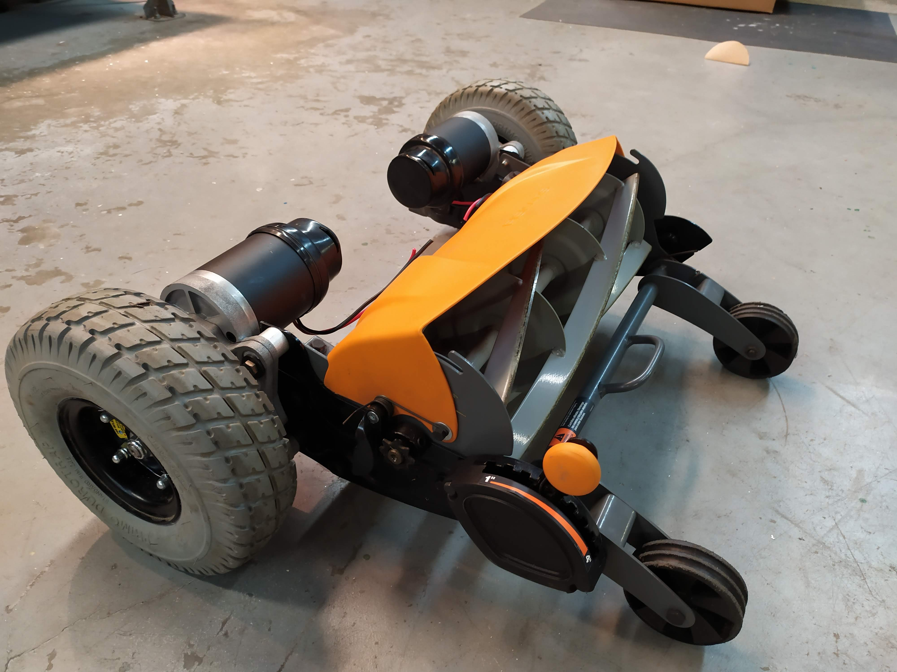

# yomo
Autonomous solar-only lawn trimming rover

# WHY?!

I want a 100% autonimous non-stupid set-it-forget-it bulk grass cutting device that I didn't have to babysit, watch, push, tow or remote into.  Setup the parimeter and let it do its thing so long as the sun is shining and the good Lord is willing!

# Technology

- Old beat up Power Chair, preferably without batteries.
- Two Hedge Trimmers; I may evaluate reel mowers too, they cut better (on short, frequently cut grass) and use about the same energy
- Raspbery Pi 3 A+ main board
- ~~Adafruit GPS HAT~~ (I need cm accuracy, regular GPS won't cut it[ouch])
- 2x NavSpark DGPS receievers
- 2x Long ranage 915mhz trasmitter/receiver modules
- 3x H-Bridge to power the motors

# Design

This is the logical and physical layout of the components

[Detailed Design](Design.md)

[The implimenation specification](Implimentation.md) details the hardware/software compontents that will make-up the rover and how/what technology they will be built on.

# Steps

## Failures
- Hedge trimmers suck for cutting grass
- You don't need a power chair to have a mower

## Current Status
- Purchased a pusher-style reel mower
- Stripped off the wheels and drive chain
- Attached power-chair-motors to right sides of reel mower
- Wrote a good start to the hardest parts of the control system
- Received the DGPS recievers

## Next
- 6/24 - Finish the mower hardware
- 6/24 - Assemble the DGPS, AHRS & H-Bridge connections on the development hat board to the raspberry pi and wire in all the components.
- 6/25 - Start writing Ops web page that will command robot in manual mode
- 6/26 - Glue together all the code I've written and start to develope a game plan to getting the software ready to test
- 6/27 - Motor that drives the reel arrives - fabricate bracket to hold it and prepare chain and chain tensioner.
- 6/27 - Start testing / mowing

## RTK GPS

** 6/20/2019 NOTE: this hasn't even arrived yet.  I'll make an update once it's here and I'm using it.

Getting a hyper accurate position sensor is really the key to this project actually working at all.  After a lot of searching I found an  inexpensive RTK GPS setup with good instructional videos and great documentation (not entirely Chineese, so really good).  It's modules only, so there's manual setups and configurations and it needs a seperate LoRa transciever to sync the sat offset data.  But the chips do all the real work and the project gets 1cm accuracy.

The whole RTK setup will "true out" at $250.  Next cheapest "hobby grade" is $600; after that it goes up steaply.  $1500 for the first shrink wrap solution then sky is the limits for survey stuff (2k-5k). 

Watch this video:
[NavSpark Overview/Setup video](https://www.youtube.com/watch?v=17fS9YZC84I)

Source:
[NavSpark Store](http://navspark.mybigcommerce.com/)

## Next steps
  - Test motor control

# Current status

I've got the chair, got the pi, assembling

